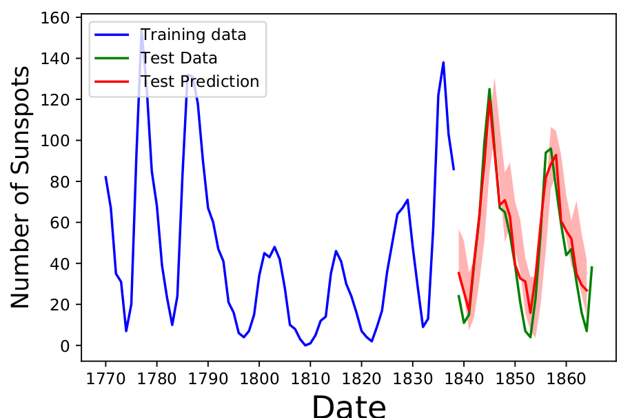

# Udacity Capstone Project

This directory contain all code that was used for the [Udacity Machine Learning Engineer Nanodegree](https://www.udacity.com/course/machine-learning-engineer-nanodegree--nd009t) Program. 
The folder [figures](figures/) contains all of the pdf figures generated by the codes. The links to the project proposal and the write-up of the final 
project are below.

* [The project proposal: project_proposal.pdf](project_proposal.pdf)
* [The write up of the final project: final_project_write_up.pdf](final_project_write_up.pdf) 

The enviroments needed to run the program can be installed from the requirements.txt in anaconda using the following command:   
$ conda create --name <env> --file requirements.txt  

# Project Summary

In this project we have taken data for time series data $(t,X_t)$ and we have trained two different neural network models,
 the feed forward neural network (FFNN) and the long-short term memory (LSTM) network, denoted as
  $G_{\rm FFNN}$ ,$G_{\rm LSTM}$ respectively; to generate a time series forecast given the value of the time series
   at the previous time step. In other words, we have generated a function $G$ such that  
$G(X_{t}) = F_{t+1}$  
where $F_{t+1}$ is similar to the $X_{t+1}$ value of the underlying time series data. 
This problem was very interesting to me as it introduced me the complexity of time-series analysis.   

# Included Code
1. [Benchmark ARIMA Results](Benchmark_ARIMA_Results.ipynb)
This jupyter notebook contains all of the code used to fit the ARIMA and SARIMA results
used for benchmarking 

2. [Time Series with FNN](Time_Series_with_FNN.ipynb)
This jupyter notebook contains all of the code used to generate the time series
results by using the Feed Forward neural network.

3. [Time Series with LSTM](Time_Series_with_LSTM.ipynb)
This jupyter notebook contains all of the code needed to generate the time series results
by using LSTM network architectures.

4. [ARIMA routines](ARIMA_routines.py)
This python code contains all of the fitting routines that are used by
the code Benchmark_ARIMA_Results.ipynb

# Datasets
The datasets that are included in the directory [data](data/) directory are the following
1. [EURUSD_15m_BID_01.01.2010-31.12.2016](data/EURUSD_15m_BID_01.01.2010-31.12.2016.csv)  
* This is the Euro to USD exchange rate data from 2010-2016  

2. [international-airline-passengers.csv](data/international-airline-passengers.csv)
* The data set of total number of international airline passengers from 1949-1960,
in thousands.  

3. [wolfer-sunspot-numbers-1770-to-1.csv](data/wolfer-sunspot-numbers-1770-to-1.csv)
* The number of sun spots observed from 1770-1869.

4. [total-annual-rainfall-in-inches-.csv](data/total-annual-rainfall-in-inches-.csv)
* The total annual rainfall in London as a function of time from 1813-1912 in inches.
